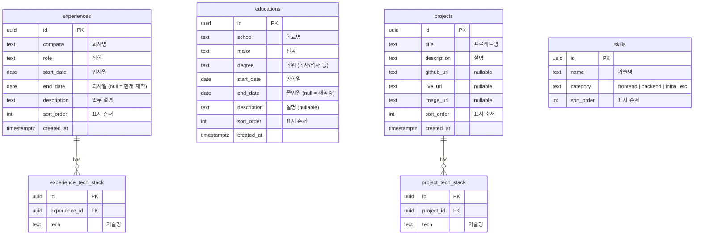

# 포트폴리오 DB ERD

## Mermaid ERD

## 테이블 설명

| 테이블 | 설명 |
|--------|------|
| `experiences` | 경력 정보. `end_date` 가 NULL이면 현재 재직 중 |
| `experience_tech_stack` | 경력별 사용 기술 (1:N) |
| `educations` | 학력 정보. `end_date` 가 NULL이면 재학 중 |
| `projects` | 프로젝트 목록 |
| `project_tech_stack` | 프로젝트별 기술 스택 (1:N) |
| `skills` | 기술 스택 목록 (카테고리 구분) |

## 주요 설계 결정

- **기간 표현**: 문자열(`"2023.03 — 현재"`) 대신 `DATE` 타입 분리 → UI에서 포맷 처리
- **tech_stack**: 배열이 아닌 별도 테이블로 분리 → 필터링/정렬 용이
- **sort_order**: 각 테이블에 포함해 표시 순서를 DB에서 제어
